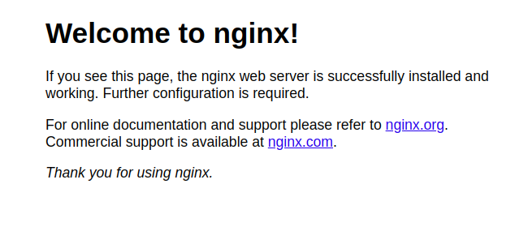

# LEMP STACK IMPLEMENTATION

# Introduction To LEMP Stack

The word LEMP refers to a group of open source software installed together which can be used to host web applications.
***LEMP*** meaning Linux; a unix operating system, Nginx; a web server capable of load balancing and can serve as a reverse proxy, Mysql; a database and PHP; an Hypertext preprocessor.

**What makes a LAMP stack different from LEMP Stack** 

The difference between a LAMP Stack and a LEMP Stack is their web servers. A LAMP Stack makes use of an apache web server and a LEMP Stack makes use of a nginx web server.
Both web servers have their advantages, while apache is highly versatile, nginx has a very high performance, capable of load balancing amd serve as a reverse proxy and is the most widely used web server.

### Advantages of LEMP Stack

i. Nginx is an important part of the LEMP Stack handles many connections at once and also highly scalability. This is important for websites and apps that need to handle many users.

ii. Understanding and implementing the LEMP Stack correctly is crucial for ensuring the security of web applications. DevOps engineers and system administrators need to be well-versed in securing each component of the stack to protect against common web vulnerabilities and attacks.

iii. MySQL, the "M" in LEMP, is a widely-used relational database management system. Knowledge of how to set up and manage databases is essential for applications that require data storage and retrieval.

iv. PHP is a common programming language used for creating websites. It is part of the LEMP stack, which is a group of software used to run web applications. Learning how to code in PHP and connect it with the LEMP Stack allows developers to make websites that are interactive and change as users interact with them.

### Target Audience

i. DevOps Engineers: DevOps professionals play a critical role in setting up and managing server environments. Understanding the LEMP Stack is essential for configuring web servers, optimizing performance, and ensuring robust security.

ii. System Administrators: System administrators responsible for server maintenance and security will find the LEMP Stack knowledge valuable. It enables them to set up and manage Linux-based web servers and databases effectively.

iii. Web Developers: Web developers looking to build dynamic websites and web applications can benefit from learning the LEMP Stack. They will gain the skills needed to create feature-rich, server-side applications.

iv. Database Administrators: Professionals tasked with database management will learn how to configure and maintain MySQL or MariaDB in the context of the LEMP Stack.

### Prerequisite

- An AWS account with an ubuntu EC2 instance
- Access to a terminal or virtual machine
- SSH. [click here](https://www.digitalocean.com/community/tutorials/how-to-set-up-ssh-keys-on-ubuntu-20-04) to learn more on ssh

### Goals To Be Accomplished By The End of The Project

By the end of this project, learners will have the knowledge and ability to set up the whole LEMP stack. You will also have the skills to make impressive, fast web applications that have a big effect in the always changing world of web development.

# Project Highlight
- LEMP Stack Implementation
- Introductin To LEMP Stack
  - What is LEMP Stack
    - What Make a LAMP Stack Different From LEMP Stack
  -  Advantages of LEMP Stack
  - Target Audience
  - Prerequisite
  - Goals To Be Accomplished By The End Of The Project

- Getting Started With LEMP Stack
  - Launch an Ubuntu Instance on AWS Console and ssh Into It Form Your Terminal
  - Installating Nginx
  - Installating Mysql
  - Installating PHP
  - Configuring Nginx Web server to Serves As A Virtual Host
  - Testing PHP with Nginx
  - Testing PHP and Mysql with Nginx (LEMP Stack)

- Real Life Scenarios With LEMP Stack

- Conclusion

# Getting Started With LEMP Stack
Let's get our hands on project LEMP

#### Step 1: Launch an Ubuntu Instance on AWS Console and SSH Into From Your Terminal

Launch an EC2 instance in AWS EC2 console
#### Step 2: Installating Nginx
update package lists and apt repositories

    sudo apt update
Install nginx web server

    sudo apt install nginx
Allow firewall for nginx

    sudo ufw allow in "Nginx HTTP"
NOTE: The step above will allow firewall for nginx on port 80, to allow firewall for nginx on port 443 or any other port, "Nginx HTTPS and Nginx Full" need to be opened. Once it is enabled, it is important we allow firewall for ssh. ssh runs on port 22, if firewall is not allowed for ssh running on port 22, connection to the ubuntu instance via ssh will be permanently denied 

    sudo ufw allow 22
    
To check if nginx web server has been installed successfully

    sudo systemctl status nginx

To access your web server on your browser

    http://ubuntu_instance_public_ip_address

The Nginx default page above will displayed. 

#### Step 3: Installating Mysql

In the previous step, we were able to install and allow firewall nginx. In this step, mysql will be installed as a database to store data for our web application.
apt repositories has been updated in the previous step, mysql should be installed directly

    sudo apt install mysql-server
Secure mysql installation 

    sudo mysql_secure_installation
Check if mysql has been successfully installed

    sudo systemctl status mysql 

Log into mysql as the root user

    sudo mysql
Log out of mysql

    mysql>exit

#### Step 4: Installing PHP

So far, we have be able to install the first three technology stack of our LEMP stack. The last software of the LEMP stack which is PHP will be installed in this step.

The installation of php is different for nginx is different from apache because, the way it interacts with the web server differs. PHP for Apache typically uses the Apache module called mod_php. This module integrates PHP directly into the Apache web server, allowing it to handle PHP requests internally. For Nginx, PHP is typically run as a separate process using FastCGI (e.g., PHP-FPM) or as a reverse proxy. This means Nginx communicates with the PHP interpreter over a network socket or through a unix domain socket.

    sudo apt install php-fpm php-mysql
Check for the successful installation of php

    php -v

#### Step 5: Configuring Nginx Web Server To Serve As A Virtual Host 
Create a directory for our codes to be hosted at the location "/var/www/html/website.", "website" can be named any name. The directory will contain the php codes which nginx will serve. The codes are not limited to php codes but also html, css, javascript e.t.c. . Nginx web server is smart enough to know this location and serve it with the help of its configuration file.

    sudo mkdir /var/www/html/website
Create an simple html file which Nginx will serve

    sudo nano /var/www/html/website/index.html
It should have the content below

    <h1>Testing LEMP, Nginx works</h1>
website is the directory created which will contain our php code
Assign ownership of the directory with the user

    sudo chown -R $USER:$USER /var/www/html/website

Create a new server block configuration that will replace nginx default server block configuration at /etc/nginx/sites-available

    sudo nano /etc/nginx/sites-available/azeez

azeez should contain the below

    server {
    listen 80;
    server_name ;
    root /var/www/html/website;

    index index.html index.htm index.php;

    location / {
        try_files $uri $uri/ =404;
    }

    location ~ \.php$ {
        include snippets/fastcgi-php.conf;
        fastcgi_pass unix:/var/run/php/php7.4-fpm.sock;
     }

    location ~ /\.ht {
        deny all;
    }
    }
Unlike apache, nginx only uses the server block configuration file in sites-enabled, sites-available only contains the different server block configuration.
To activate a server block, you create a symbolic link from the sites-enabled directory to the configuration file in the sites-available directory. This link tells Nginx to use that configuration.

Creating a symbolic link 

    sudo ln -s /etc/nginx/sites-available/website /etc/nginx/sites-enabled/

Unlinking the default server block configuration file from sites enables

    sudo rm /etc/nginx/sites-enabled/default
or

    sudo unlink /etc/nginx/sites-enabled/default

Reload nginx conf. file to make sure the file has no errors

    sudo nginx -t

Reload nginx

    sudo systemctl reload nginx

Check your web browser.

    http://ubuntu_instance_public_ip_address

#### Step 6: Testing PHP with Nginx 

Replace the index.html file in /var/www/html/website/ with index.php with a simple php info.

    sudo nano /var/www/html/website/index.php
Paste the contents below

    <?php
    phpinfo();
Save and close the file 
You can use ubuntu instance public ip address to access the php file served by nginx from your web browser 

The default page above will be displayed.

#### Step 7: Testing PHP and Mysql with Nginx (LEMP Stack)

In the previous step, php was tested with nginx by using nginx to serve a php file. In the step mysql database will be connected to php and web served by nginx.
The first to do is to create a database with datas

Log into mysql as root user 

    sudo mysql 

***In the mysql shell***
Create a database called azeez

    CREATE DATABASE azeez;

Create a new user called ***my_user*** with password ***A different username or password can be used***

    CREATE USER 'my_user'@'%' IDENTIFIED WITH mysql_native_password BY 'Ab123456789';
Grant 'my_user' all permissions 

    GRANT ALL ON root.* TO 'my_user'@'%';
Log out of mysql

    exit
Log in to mysql as user 'my_user'

    mysql -u my_usr -p Aa123456789

Checkout the database created as the root user

    SHOW DATABASES;
The output below will be printed

    +--------------------+
    | Database           |
    +--------------------+
    | azeez              |
    | information_schema |
    +--------------------+
    2 rows in set (0.000 sec)
Create a table called devops_list in the database created 

    CREATE TABLE azeez.devops_list (
	item_id INT AUTO_INCREMENT,
	content VARCHAR(255),
	PRIMARY KEY(item_id)
    );
Add a few lines to the list

    INSERT INTO azeez.devops_list (content) VALUES ("Linux needed for devops");
    INSERT INTO azeez.devops_list (content) VALUES ("Git needed for devops");
    INSERT INTO azeez.devops_list (content) VALUES ("LAMP needed for devops");

Check that the lines have been successfully inputed

    SELECT * FROM azeez.devops_list;
To output below will be shown 

    +---------+--------------------------+
    | item_id | content                  |
    +---------+--------------------------+
    |       1 | Linux needed for devops  |
    |       2 | Git needed for devops    |
    |       3 | LAMP needed for devops   |
    +---------+--------------------------+
    3 rows in set (0.000 sec)
Exit mysql shell.

In the /var/www/html we need to edit our index.php file

    sudo nano /var/www/html/index.php
Paste the content below 

    <?php
    $user = "my_user";
    $password = "Ab123456789";
    $database = "azeez";
    $table = "devops_list";
    
    try {
    $db = new PDO("mysql:host=localhost;dbname=$database", $user, $password);
    echo "<h2>Devops</h2><ol>"; 
    foreach($db->query("SELECT content FROM $table") as $row) {
    echo "<li>" . $row['content'] . "</li>";
    }
    echo "</ol>";
    } catch (PDOException $e) {
    print "Error!: " . $e->getMessage() . " ";
    die();
    }
Save and close the file
Check you web browser with your ubuntu instance ip address to see nginx serving php with the contents in the database displayed.

## Task For This Project
i. Launch an ubuntu instance and ssh into it.

ii. Set up a LEMP Stack

iii. Download a simple bootstrap code to host on your Stack. Use <wget https://github.com/startbootstrap/startbootstrap-agency/archive/gh-pages.zip>

iv. unzip the folder host it on your LEMP Stack 

***Hint:*** unzip the folder with the command "unzip" if not installed, installed unzip with 

	sudo apt install unzip
 Then move the whole folder you unziped to your project folder and update the server block configuration file.

